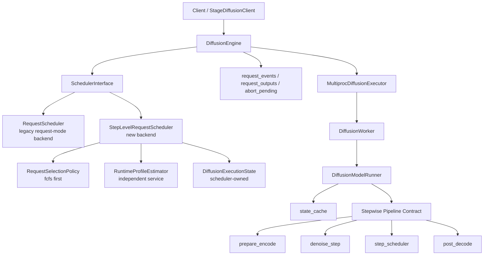
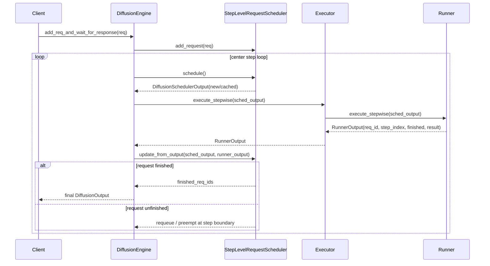

# `v16-base` Step-Level 调度 + 调度策略合入 `v18-base` 的最小落地方案

## 0. 结论先行

这次合入不建议直接把 `v16-base` 的历史 `Stage1Scheduler` 整类搬进 `v18-base`。

最终落地方案应以 PR `#1625` 已经确立的分层为主干：

- `scheduler` 负责 request lifecycle 和 policy
- `engine` 负责中心化调度循环与等待/唤醒
- `executor/worker/runner` 负责执行与 stepwise state cache

在这个前提下，把 `v16-base` 的能力拆成三块按层并入：

1. `StepLevelRequestScheduler` 新 backend
2. `RequestSelectionPolicy` 策略层
3. `RuntimeProfileEstimator` 独立估时服务

最小可落地版本只做下面这个闭环：

- 支持 `step_level_request_scheduler + step_chunk=True`
- 支持 step 边界抢占
- 支持 `abort`
- 只保证单请求、非 batch 的 step-level 主路径
- 支持 policy 抽象，但首版只正式启用 `fcfs`
- 保留 `request_scheduler + step_chunk=False` 作为默认稳定路径

这意味着：

- `v16-base` 的“step level 调度能力”在首版就落地
- `v16-base` 的“策略能力”通过新 policy 框架保留迁移路径
- 复杂策略不在首版一次性并入，而是按 `fcfs -> sjf -> p95-first -> guarded -> fusion` 逐批迁移

## 1. 设计基线

这份方案综合以下事实后给出最终取舍：

- PR `#1625` 已将 diffusion 调整为 `SchedulerInterface -> RequestScheduler -> DiffusionEngine -> executor` 的分层，且把 scheduler 和 executor 的边界理顺
- `v18-base` 当前已经具备 stepwise worker/runner contract：
  - `DiffusionWorker.execute_stepwise()`
  - `DiffusionModelRunner.execute_stepwise()`
  - `RunnerOutput`
  - runner-side `state_cache`
- `v18-base` 当前缺的不是 stepwise 执行能力，而是：
  - step-aware scheduler backend
  - engine 内部中心化 step loop
  - unfinished continuation contract
  - abort 闭环
- `v16-base` 的 `Stage1Scheduler` 同时混合了：
  - waiting/running queue
  - runtime estimate
  - policy
  - chunk lifecycle
  - worker IPC
  - abort / finish / metrics

最终判断：

- 可以迁移 `Stage1Scheduler` 的策略语义
- 不应迁移 `Stage1Scheduler` 的“一体化类结构”
- 不应把 `v16-base` 的 `prepare_generation / step_generation / finalize_generation` 再覆盖到 `v18-base`
- 应直接复用 `v18-base` 现有 stepwise pipeline contract：
  - `prepare_encode`
  - `denoise_step`
  - `step_scheduler`
  - `post_decode`

## 2. 范围界定

### In Scope

- `v18-base` 中新增 `StepLevelRequestScheduler`
- scheduler-owned execution state
- 中心化 step loop
- step 边界 RR preemption
- `abort()` 端到端打通
- config/CLI/stage builder 参数透传
- policy 抽象落地
- 首版 `fcfs` policy
- `RuntimeProfileEstimator` 作为独立 service 落地

### Out of Scope

- step 内中断
- `batch_size > 1` 的 continuous batching
- `generate_batch()` / multi-prompt request / stage batch fast path
- step mode 下的 cache backend / KV transfer / LoRA
- 一次性迁完 `p95-fusion`、`guarded`、`defer-budget` 全部策略
- 把 `global scheduler` 一起并入
- 回退 `#1625` 的 executor/scheduler 分层

## 3. 最终架构

### 3.1 模块架构图



### 3.2 step-level 数据流



### 3.3 状态所有权

| 状态/字段 | Owner | 写入者 | 说明 |
| --- | --- | --- | --- |
| `request_id` | `OmniDiffusionRequest` | ingress | 用户可见 id |
| `sched_req_id` | scheduler | scheduler | scheduler 内部唯一键 |
| `WAITING/RUNNING/PREEMPTED/FINISHED_*` | scheduler | scheduler | 生命周期真相源 |
| `executed_steps` | scheduler-owned `DiffusionExecutionState` | scheduler | 由 `RunnerOutput` 推进，request 仅镜像 |
| `total_steps` | scheduler-owned `DiffusionExecutionState` | scheduler/init | 从 request 初始化 |
| `planned_chunk_budget_steps` | scheduler-owned `DiffusionExecutionState` | scheduler | 本轮 budget |
| `estimated_runtime_s` | scheduler-owned `DiffusionExecutionState` | scheduler/estimator | policy 只读输入 |
| runner `state_cache` | runner | runner | 恢复执行现场 |
| final `DiffusionOutput` | engine | engine | 唤醒 waiter 前保存 |
| `abort_pending` | scheduler | engine + scheduler | running 请求在 step 边界收敛 |

强约束：

- `executor/runner` 不直接决定 finished 状态
- `request` 上的镜像字段不能反向覆盖 scheduler state
- unfinished continuation 必须由 scheduler 重新入队

## 4. 最小支持矩阵

首版只支持两组组合：

| backend | step_chunk | 结论 |
| --- | --- | --- |
| `request_scheduler` | `False` | 默认稳定路径 |
| `step_level_request_scheduler` | `True` | 新 experimental 路径，仅覆盖单请求非 batch 主路径 |

首版直接报 `config error` 的组合：

| backend | step_chunk | 原因 |
| --- | --- | --- |
| `request_scheduler` | `True` | 旧 backend 不消费 unfinished continuation |
| `step_level_request_scheduler` | `False` | 新 backend 的存在价值就是 step-level 调度 |

`instance_scheduler_policy` 首版规则：

- 只有 `diffusion_scheduler_backend == "step_level_request_scheduler"` 时才读取
- 首版只接受 `fcfs`
- 其他策略值直接报 `NotImplementedError`

这样做的原因不是“功能少”，而是要先把 contract 稳住，避免半定义模式进入主干。

额外约束：

- 当 `diffusion_scheduler_backend == "step_level_request_scheduler"` 时，首版只支持单请求非 batch 主路径
- 若调用 `generate_batch()`、`StageDiffusionClient.add_batch_request_async()` 或构造 `len(request.prompts) > 1` 的 diffusion request，首版直接报 `NotImplementedError`

## 5. 最终代码方案

### 5.1 配置与入口

#### `vllm_omni/diffusion/data.py`

在 `OmniDiffusionConfig` 中新增最小字段：

- `diffusion_scheduler_backend: str = "request_scheduler"`
- `instance_scheduler_policy: str = "fcfs"`
- `diffusion_enable_step_chunk: bool = False`
- `diffusion_enable_chunk_preemption: bool = False`
- `diffusion_chunk_budget_steps: int = 1`
- `instance_runtime_profile_path: str | None = None`
- `instance_runtime_profile_name: str | None = None`

并在 `__post_init__` 中做组合校验。

关于 step mode 开关，首版必须明确：

- `step_execution` 继续作为 worker/runner 内部实际生效字段
- `diffusion_enable_step_chunk` 作为面向 scheduler/backend 的公开配置
- 当 `diffusion_scheduler_backend == "step_level_request_scheduler"` 时：
  - `diffusion_enable_step_chunk` 必须为 `True`
  - config builder 必须同步派生 `step_execution=True`
- 不单独暴露“backend 已切换但 `step_execution=False`”这种半定义模式

#### `vllm_omni/engine/async_omni_engine.py`
#### `vllm_omni/config/stage_config.py`
#### `vllm_omni/entrypoints/cli/serve.py`

透传并序列化上述字段。

原则：

- 以 `AsyncOmniEngine._create_default_diffusion_stage_cfg()` 为 diffusion config 主入口
- 不恢复 `v16-base` 在 `AsyncOmni` 里那套大而全的 builder
- 首版 CLI 只暴露最小集合，不把 `p95-fusion` 等策略参数一次性公开

### 5.2 request / scheduler state

#### `vllm_omni/diffusion/request.py`

保留当前 `auto-seed` 逻辑，同时只补最小镜像字段：

- `arrival_time`
- `first_enqueue_time`
- `first_dispatch_time`
- `last_dispatch_time`
- `last_preempted_time`
- `completion_time`
- `failure_time`
- `aborted_time`
- `request_state`
- `executed_steps`
- `max_steps_this_turn`
- `dispatch_epoch`

首版不把以下字段继续放到 request 真相源里：

- `estimated_cost_s`
- `deadline_ts`
- `scheduler_force_run_to_completion`
- `scheduler_chunk_budget_steps`

这些信息迁到 scheduler-owned `DiffusionExecutionState`。

#### `vllm_omni/diffusion/sched/interface.py`

新增：

- `DiffusionExecutionState`
- `ExecutionOutput = DiffusionOutput | RunnerOutput`

并放宽：

```python
def update_from_output(
    self,
    sched_output: DiffusionSchedulerOutput,
    output: DiffusionOutput | RunnerOutput,
) -> set[str]:
    ...
```

MVP 里需要明确两条 contract：

- request-mode backend 继续消费 `DiffusionOutput`
- step-level backend 消费 `RunnerOutput`

也就是说，unfinished continuation 语义只通过 `RunnerOutput.finished=False` 表达，不要求扩展 `DiffusionOutput` 去承载 unfinished 状态。

#### `vllm_omni/diffusion/sched/base_scheduler.py`

扩展公共宿主能力：

- `_execution_states: dict[str, DiffusionExecutionState]`
- `_abort_pending: set[str]`
- execution state 的 create/pop/cleanup
- `mark_abort_pending()` 或等价 helper

### 5.3 新 backend

#### 新增 `vllm_omni/diffusion/sched/step_level_request_scheduler.py`

职责：

- 继承 `_BaseScheduler`
- 复用 `waiting/running/finished`、`sched_req_id`、`finish_requests()`、`preempt_request()`
- 新增 step-aware `schedule()`
- 新增 step-aware `update_from_output()`

首版 schedule 语义：

1. 若存在 running 请求且 waiting 非空，且启用 chunk preemption，则在本轮前对当前 running 请求执行一次 `preempt_request()`
2. 用 policy 从 waiting 中选 1 个请求
3. 若该请求第一次运行，放入 `scheduled_new_reqs`
4. 若该请求为 cached continuation，放入 `scheduled_cached_reqs`
5. 为其设置：
   - `planned_chunk_budget_steps`
   - `dispatch_epoch += 1`
   - request mirror fields

首版 `chunk_budget` 规则：

- 默认固定 `1`
- `diffusion_chunk_budget_steps` 只作为上限保留
- 若后续迁移 `p95-fusion` 等策略，再把 budget planning 从固定 `1` 扩展为动态值

首版 `update_from_output()` 语义：

- `RunnerOutput.finished=False`
  - 更新 `executed_steps`
  - 若被标记 `abort_pending`，收敛到 `FINISHED_ABORTED`
  - 否则回到 `WAITING/PREEMPTED`
- `RunnerOutput.finished=True`
  - `result.error is None -> FINISHED_COMPLETED`
  - `result.error is not None -> FINISHED_ERROR`

首版实现时建议补一条显式保护：

- 若 step-level backend 收到 `len(req.prompts) > 1` 的 request，直接失败
- 不在 scheduler/backend 里偷偷尝试复用 batch request 语义

### 5.4 policy 层

#### 新增 `vllm_omni/diffusion/sched/policy.py`

定义最小策略抽象：

```python
class RequestSelectionPolicy(Protocol):
    def order_waiting(
        self,
        waiting: list[str],
        request_states: dict[str, DiffusionRequestState],
        execution_states: dict[str, DiffusionExecutionState],
    ) -> list[str]:
        ...
```

首版只实现：

- `FCFSSelectionPolicy`

这样做的目的不是多此一举，而是为了让 `v16-base` 的策略后续能按同一接口逐步迁入。

### 5.5 runtime estimator

#### 新增 `vllm_omni/diffusion/runtime_profile.py`

直接迁入 `v16-base` 的 `RuntimeProfileEstimator`，但只作为独立 service。

首版用途：

- 初始化 `DiffusionExecutionState.estimated_runtime_s`
- 给后续 `sjf` 和 `p95-first` 留接口

首版不做：

- 在 `fcfs` 中影响排序
- 把 estimator 逻辑塞回 scheduler 主体

### 5.6 engine 主闭环

#### `vllm_omni/diffusion/diffusion_engine.py`

这是首版的真正核心改动。

需要新增：

- backend 选择
- 中心化 `_scheduler_thread`
- `_scheduler_cv`
- `_request_events`
- `_request_outputs`
- `_request_errors`
- `_fatal_error`

初始化逻辑：

```python
if scheduler is not None:
    self.scheduler = scheduler
elif od_config.diffusion_scheduler_backend == "step_level_request_scheduler":
    self.scheduler = StepLevelRequestScheduler(...)
else:
    self.scheduler = RequestScheduler()
```

初始化顺序必须固定为：

1. 创建 scheduler / executor
2. 创建 `_engine_lock` / `_scheduler_cv` / `_request_events` / `_request_outputs` / `_fatal_error`
3. 如果 backend 是 `step_level_request_scheduler`，先启动 `_scheduler_thread`
4. 最后再执行 `_dummy_run()`

不能把 `_dummy_run()` 放在 scheduler thread 启动之前，否则 step-level backend 的 warmup request 会无人推进。

### 5.6.1 engine 锁设计

这部分在 MVP 中必须明确，否则 step-level 路径非常容易在并发下失稳。

当前 `v18-base` 的现实是：

- [diffusion_engine.py:278](/home/tianzhu/vllm-omni/vllm_omni/diffusion/diffusion_engine.py#L278) 会在整次 `add_req_and_wait_for_response()` 外层持有 `_rpc_lock`
- [diffusion_engine.py:384](/home/tianzhu/vllm-omni/vllm_omni/diffusion/diffusion_engine.py#L384) 的 `collective_rpc()` 也会持有同一把 `_rpc_lock`
- executor 当前仍是单广播队列 + 单结果队列模型，不适合并发发 RPC 后再靠 reply demux 区分返回

所以首版不建议一上来拆成复杂多锁，而是采用：

- 一把 engine 级互斥锁
- 一个基于该锁的 condition variable
- 每请求一个 `threading.Event`

推荐命名：

- `_engine_lock`
- `_scheduler_cv = threading.Condition(_engine_lock)`

如果为了最小 diff 暂时不重命名，也至少要把现有 `_rpc_lock` 的语义改成“engine 主锁”，而不是“单纯 RPC 锁”。

MVP 下，这把锁保护的对象必须包括：

- scheduler 的全部状态变更
- `_request_events`
- `_request_outputs`
- `_request_errors`
- `_closed`
- scheduler thread 的 wake/sleep
- 任意一次下行到 executor 的 RPC

也就是说，在 `step_level_request_scheduler` 模式下，一个 step 的临界区就是：

```python
with self._engine_lock:
    sched_output = self.scheduler.schedule()
    runner_output = self.executor.execute_stepwise(sched_output)
    finished = self.scheduler.update_from_output(sched_output, runner_output)
    ...
```

这个设计的关键取舍是：

- 新请求和 abort 不要求“step 内立即生效”
- 只要求“step 边界可见”
- 因此 engine 主锁跨单个 step 持有是可以接受的

但它绝对不能再像当前实现那样跨整次请求持有。

### 5.6.2 并发语义与不变量

首版明确采用下面这些不变量：

1. 任意时刻最多只有一个 in-flight diffusion worker RPC
2. 任何 scheduler 状态修改都只能在 `_engine_lock` 下发生
3. 任何 `executor.collective_rpc()` / `executor.execute_stepwise()` / `executor.add_req()` 调用都必须在 `_engine_lock` 下发生
4. 调用线程等待 `Event.wait()` 时不能持有 `_engine_lock`
5. `Event.set()` 前必须先把最终输出写入 `_request_outputs`
6. `abort()` 对 running request 的语义是“标记 pending，最迟一个 step 后收敛”

这样设计的原因：

- 兼容当前 executor 的单结果队列
- 不需要额外引入 reply correlation id
- 能保证 `profile()` / `add_lora()` / `pin_lora()` 这类 control RPC 不会和 step loop 抢同一条返回通道

### 5.6.3 请求提交流程的锁边界

`step_level_request_scheduler` 模式下，`add_req_and_wait_for_response()` 应拆成两个持锁区间：

```python
def add_req_and_wait_for_response(self, request):
    with self._engine_lock:
        sched_req_id = self.scheduler.add_request(request)
        event = threading.Event()
        self._request_events[sched_req_id] = event
        self._scheduler_cv.notify_all()

    event.wait()

    with self._engine_lock:
        output = self._request_outputs.pop(sched_req_id)
        self.scheduler.pop_request_state(sched_req_id)
        self._request_events.pop(sched_req_id, None)
        return output
```

这里最重要的是：

- 提交后立即释放锁，让后台 loop 有机会推进
- 等待 event 时绝不持锁
- 取结果和 cleanup 时再重新进入锁
- 若 `_fatal_error` 已写入，必须优先返回合成 error output，而不是继续假设正常完成

### 5.6.4 scheduler thread 的锁边界

后台 loop 建议固定成下面的模式：

```python
def _scheduler_loop(self):
    while True:
        with self._engine_lock:
            while not self._closed and not self.scheduler.has_requests():
                self._scheduler_cv.wait()
            if self._closed:
                return

            sched_output = self.scheduler.schedule()
            if sched_output.is_empty:
                continue

            runner_output = self.executor.execute_stepwise(sched_output)

            finished = self.scheduler.update_from_output(sched_output, runner_output)
            ...
```

首版这里故意保持“单锁包住单 step”。

原因不是它最优，而是它最符合当前 executor contract。

如果后续要优化成“state lock + transport lock”双锁模型，前提必须是：

- executor 返回通道支持更强的 response demux
- control RPC 和 step RPC 的并发约束重新定义

这不属于最小落地版本。

### 5.6.5 `abort()`、`collective_rpc()`、`close()` 的锁规则

`abort()`：

- 在 `_engine_lock` 下执行
- waiting 请求：直接 finish + 写入 aborted output + `event.set()`
- running 请求：只写 `abort_pending`
- 最后 `notify_all()` 唤醒 scheduler thread

`collective_rpc()`：

- 在 step-level 模式下，仍然必须走 `_engine_lock`
- 因为它和 scheduler loop 共用同一 executor 返回通道
- 所以文档层面要明确：control RPC 与 step loop 是串行化关系，不承诺并发

后台线程异常：

- `_scheduler_thread` 必须有最外层 `try/except`
- 一旦 step RPC / scheduler update / cleanup 发生未恢复异常：
  - 在 `_engine_lock` 下写入 `_fatal_error`
  - 为所有 pending request 合成 error `DiffusionOutput`
  - 对应 `event.set()`
  - `notify_all()`
- 不能让调用线程无限阻塞在 `event.wait()`

`close()`：

- 先在 `_engine_lock` 下设置 `_closed=True` 并 `notify_all()`
- 为所有 pending request 合成 `ENGINE_CLOSED` 错误输出并 `event.set()`
- 再在锁外 `join(_scheduler_thread)`
- 最后关闭 scheduler/executor

这样可以避免：

- 持锁等待线程退出导致死锁
- scheduler thread 退出时再反过来等待 engine 主线程释放锁

执行逻辑拆成两条：

- `request_scheduler`:
  - 保持现有 request-mode `add_req_and_wait_for_response()`
- `step_level_request_scheduler`:
  - 调用线程只负责提交 request + wait event
  - 后台线程负责循环：
    - `schedule()`
    - `executor.execute_stepwise(...)`
    - `scheduler.update_from_output(...)`
    - 保存最终输出并唤醒 waiter

关键决策：

- 不把 `v16-base` 的 chunk budget planning 继续放在 engine 层
- chunk planning 必须迁回 scheduler
- engine 主锁持有范围从“整请求”缩到“单次 step 调度/RPC/结果回写”
- 首版保留“单锁串行化 transport”的保守语义，先保证正确性，再考虑拆双锁优化

### 5.7 abort 闭环

#### `vllm_omni/diffusion/diffusion_engine.py`

实现 `abort(request_id)`：

- waiting 请求：直接 `FINISHED_ABORTED` 并唤醒 waiter
- running 请求：标记 `abort_pending`
- 当前 step 返回后由 scheduler 收敛终态
- close / fatal error 场景也必须保证 waiter 收敛，不允许无限等待

#### `vllm_omni/diffusion/stage_diffusion_client.py`

当前只做 `task.cancel()` 不够。

需要改成：

- cancel 本地 task
- 同时调用底层 `AsyncOmniDiffusion.abort()`
- 当 backend 为 `step_level_request_scheduler` 时，`add_batch_request_async()` 直接拒绝，不进入 batch fast path

否则 stage 层取消后 engine 内部请求仍可能继续跑。

### 5.8 executor / worker / pipeline

首版尽量不改 worker / runner / pipeline：

- `vllm_omni/diffusion/worker/diffusion_worker.py`
- `vllm_omni/diffusion/worker/diffusion_model_runner.py`

原因：

- 当前已经具备 `execute_stepwise()` 所需能力
- 不希望重新引入 `v16-base` 的 pipeline lifecycle API

但 executor 允许一个非常小的定向改动：

- 在 `DiffusionExecutor` / `MultiprocDiffusionExecutor` 中新增 `execute_stepwise(scheduler_output)` helper
- 该 helper 内部固定执行：
  - 所有 rank 执行 stepwise RPC
  - 只有 rank0 回复
  - 返回单个 rank0 `RunnerOutput`

这样做的原因是当前 `collective_rpc(..., unique_reply_rank=0)` 并不会让所有 rank 执行，而 step-level diffusion 必须是 all-rank execute。

结论：

- 不迁 `v16-base` 的 `prepare_generation / step_generation / finalize_generation`
- 复用 `v18-base` 现有 stepwise pipeline contract
- executor 仅补最小 transport helper，不改 worker/runner 核心逻辑

## 6. 策略迁移顺序

`v16-base` 策略不应在首版一次性全部带上。

推荐固定顺序：

1. `fcfs`
2. `sjf`
3. `p95-first`
4. `sjf_aging` / `sjf_aging_guarded` / `sjf_aging_guarded_tail`
5. `type_fifo_defer_budget`
6. `slack_hybrid`
7. `p95-fusion`

其中：

- 首版 merge 完成标准只要求 `fcfs`
- 第二轮最小策略扩展建议优先 `sjf`
- `p95-fusion` 最后迁，因为它同时依赖：
  - dynamic chunk budget
  - heavy/light lane 语义
  - runtime estimator
  - tail budget / borrowed capacity

## 7. PR 拆分建议

### PR1: config + state scaffold

文件：

- `diffusion/data.py`
- `diffusion/request.py`
- `engine/async_omni_engine.py`
- `config/stage_config.py`
- `entrypoints/cli/serve.py`
- `tests/entrypoints/test_async_omni_diffusion_config.py`
- `tests/diffusion/test_diffusion_request.py`

目标：

- 参数可表达
- request mirror 字段落地
- 默认行为不变

### PR2: scheduler kernel + runtime estimator

文件：

- `diffusion/runtime_profile.py`
- `diffusion/sched/interface.py`
- `diffusion/sched/base_scheduler.py`
- `diffusion/sched/policy.py`
- `diffusion/sched/__init__.py`

目标：

- contract 扩展完成
- policy 接口完成
- `RuntimeProfileEstimator` 落地

### PR3: `StepLevelRequestScheduler` + engine step loop + abort

文件：

- 新增 `diffusion/sched/step_level_request_scheduler.py`
- `diffusion/diffusion_engine.py`
- `diffusion/stage_diffusion_client.py`
- `tests/diffusion/test_diffusion_scheduler.py`
- `tests/diffusion/test_multiproc_engine_concurrency.py`
- `tests/diffusion/test_diffusion_step_pipeline.py`

目标：

- `step_level_request_scheduler + fcfs + 1-step RR` 跑通
- abort 跑通
- default path 无回归

### PR4: 第一批策略迁移

文件：

- `diffusion/sched/policy.py` 或分文件 policy 目录
- `tests/diffusion/test_step_level_request_scheduler_policy.py`

目标：

- `sjf`
- 后续再开 PR 迁 `p95-first`

## 8. 测试与验收

### 8.1 必测

- `request_scheduler + step_chunk=False` 回归
- `step_level_request_scheduler + step_chunk=True` 完整闭环
- `step_level_request_scheduler` 初始化后 `_dummy_run()` 不死锁
- 两个请求交错执行
- 长请求运行中，短请求最迟一个 step 后获得执行机会
- waiting/running abort 都能收敛
- cached request 能从 runner `state_cache` 恢复
- finished/error/abort 不会被晚到结果复活
- scheduler thread fatal error / close 时 waiter 能被唤醒
- 多卡场景下 `execute_stepwise()` 确认是 all-rank execute、rank0 reply

### 8.2 建议新增测试

- `tests/diffusion/test_diffusion_scheduler.py`
  - unfinished 不进入 terminal
  - cached continuation 正确调度
  - preempt 后回 waiting
- `tests/diffusion/test_diffusion_step_pipeline.py`
  - `execute_stepwise` 新/旧 request 路径
  - state cache 清理
- `tests/diffusion/test_multiproc_engine_concurrency.py`
  - step loop 与 control RPC 串行化不串结果
  - close / fatal error 不遗留 waiter
- `tests/entrypoints/test_async_omni_diffusion_config.py`
  - backend + step_chunk 组合校验
- `tests/engine/test_async_omni_engine_abort.py`
  - diffusion stage abort 下钻

### 8.3 DoD

满足以下条件视为首版完成：

1. 默认用户不传新参数时行为与 `v18-base` 一致
2. `step_level_request_scheduler + step_chunk=True` 可稳定执行 stepwise diffusion
3. 抢占只在 step 边界发生，且语义稳定
4. running abort 的生效上界为一个 denoise step
5. request lifecycle、runner state cache、final output 三者没有双写/漏清理
6. 多卡 stepwise 执行是 all-rank execute，不存在只在 rank0 执行的退化路径
7. close / fatal error / abort 都不会留下永久阻塞的 waiter

## 9. 风险与回滚

### 主要风险

- 中心化 step loop 引入新的线程同步复杂度
- 每 step 一次 IPC 会放大调度开销
- `abort_pending` 与晚到输出的竞争条件需要测试兜住
- 首版只有 `fcfs`，策略收益要等后续 PR

### 回滚路径

只保留两个开关即可快速回退：

- `diffusion_scheduler_backend="request_scheduler"`
- `diffusion_enable_step_chunk=False`

因为默认路径不变，所以回滚代价很低。

## 10. 最终拍板

最终建议采用下面这条路线作为实现基线：

1. 继续沿用 PR `#1625` 的 scheduler/executor/engine 边界
2. 不直接移植 `Stage1Scheduler` 类
3. 直接复用现有 stepwise runner contract，不再迁 `v16-base` pipeline lifecycle API
4. 新增 `StepLevelRequestScheduler` 作为唯一的新 backend
5. 首版只落 `fcfs`，但同时把 policy 抽象和 runtime estimator 一起搭好
6. 复杂策略按独立 PR 分批迁移，不与 step-level 主闭环捆绑

这条路线是当前冲突面最小、回滚最简单、最符合 `v18-base` 结构的一条合入路径。
